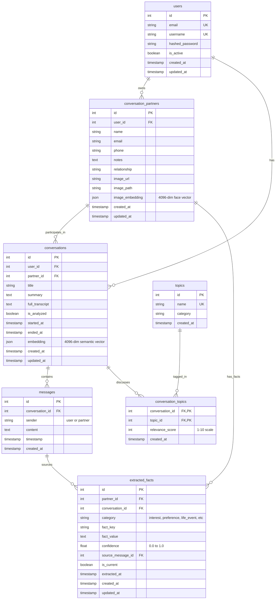

# Entity Relationship Diagram

## Database: AI Conversation Assistant



## Detailed Relationships

### 1. User → Conversation Partners
- **Type**: One-to-Many
- **Relationship**: A user can have multiple conversation partners
- **Foreign Key**: `conversation_partners.user_id` → `users.id`

### 2. User → Conversations
- **Type**: One-to-Many
- **Relationship**: A user can have multiple conversations
- **Foreign Key**: `conversations.user_id` → `users.id`

### 3. Conversation Partner → Conversations
- **Type**: One-to-Many
- **Relationship**: A conversation partner can participate in multiple conversations
- **Foreign Key**: `conversations.partner_id` → `conversation_partners.id`

### 4. Conversation Partner → Extracted Facts
- **Type**: One-to-Many
- **Relationship**: A conversation partner can have multiple facts extracted about them
- **Foreign Key**: `extracted_facts.partner_id` → `conversation_partners.id`

### 5. Conversation → Messages
- **Type**: One-to-Many (CASCADE DELETE)
- **Relationship**: A conversation contains multiple messages
- **Foreign Key**: `messages.conversation_id` → `conversations.id`
- **Cascade**: Deleting a conversation deletes all its messages

### 6. Conversation → Topics (Many-to-Many)
- **Type**: Many-to-Many
- **Association Table**: `conversation_topics`
- **Relationship**: A conversation can discuss multiple topics; a topic can appear in multiple conversations
- **Foreign Keys**:
  - `conversation_topics.conversation_id` → `conversations.id`
  - `conversation_topics.topic_id` → `topics.id`

### 7. Message → Extracted Facts
- **Type**: One-to-Many
- **Relationship**: Facts can be traced back to specific messages
- **Foreign Key**: `extracted_facts.source_message_id` → `messages.id`

### 8. Conversation → Extracted Facts
- **Type**: One-to-Many
- **Relationship**: Facts are extracted from conversations
- **Foreign Key**: `extracted_facts.conversation_id` → `conversations.id`

## Data Flow Diagram

```
┌─────────────────────────────────────────────────────────────┐
│                    USER CREATES ACCOUNT                      │
│                           │                                  │
│                           ▼                                  │
│              ┌────────────────────────┐                      │
│              │   Add Partner Info     │                      │
│              │  + Upload Face Image   │                      │
│              └───────────┬────────────┘                      │
│                          │                                   │
│                          ▼                                   │
│              ┌────────────────────────┐                      │
│              │  Face Recognition      │                      │
│              │  Generates Embedding   │                      │
│              │     (4096-dim)         │                      │
│              └───────────┬────────────┘                      │
│                          │                                   │
└──────────────────────────┼───────────────────────────────────┘
                           │
                           ▼
┌─────────────────────────────────────────────────────────────┐
│                 CONVERSATION SESSION STARTS                  │
│                           │                                  │
│                           ▼                                  │
│              ┌────────────────────────┐                      │
│              │  Camera recognizes     │                      │
│              │  partner via face      │                      │
│              └───────────┬────────────┘                      │
│                          │                                   │
│                          ▼                                   │
│              ┌────────────────────────┐                      │
│              │   Live Transcription   │                      │
│              │    (via Deepgram)      │                      │
│              └───────────┬────────────┘                      │
│                          │                                   │
│                          ▼                                   │
│              ┌────────────────────────┐                      │
│              │  Store Conversation    │                      │
│              │  + Full Transcript     │                      │
│              └───────────┬────────────┘                      │
└──────────────────────────┼───────────────────────────────────┘
                           │
                           ▼
┌─────────────────────────────────────────────────────────────┐
│                   AI ANALYSIS (Gemini)                       │
│                           │                                  │
│              ┌────────────┴────────────┐                     │
│              ▼                         ▼                     │
│    ┌──────────────────┐    ┌──────────────────┐            │
│    │  Extract Facts   │    │  Identify Topics │            │
│    │  + Confidence    │    │  + Relevance     │            │
│    └────────┬─────────┘    └─────────┬────────┘            │
│             │                         │                     │
│             ▼                         ▼                     │
│    ┌──────────────────┐    ┌──────────────────┐            │
│    │ Store in         │    │ Link Topics to   │            │
│    │ extracted_facts  │    │ Conversation     │            │
│    └──────────────────┘    └──────────────────┘            │
│                                                              │
│             ┌────────────────────────┐                      │
│             │  Generate Summary      │                      │
│             │  + Conversation        │                      │
│             │    Starters            │                      │
│             └────────────────────────┘                      │
└─────────────────────────────────────────────────────────────┘
```

## Vector Embeddings in the System

### Face Recognition Flow
```
Face Image → Face Recognition Model → 4096-dim Vector → Store in image_embedding
                                                              │
                                                              ▼
                                             Compare with stored embeddings
                                                              │
                                                              ▼
                                                    Identify conversation partner
```

### Semantic Search Flow
```
Conversation Text → Gemini Embedding API → 4096-dim Vector → Store in embedding
                                                                    │
                                                                    ▼
                                                      Enable semantic search
                                                      to find similar conversations
```

## Cascade Delete Behavior

```
DELETE User
   ├─> Does NOT cascade to conversation_partners (foreign key constraint would fail)
   └─> Does NOT cascade to conversations (foreign key constraint would fail)

DELETE Conversation
   └─> Cascades to messages (all messages deleted)

Note: Manual deletion or archiving strategy needed for orphaned records
```

## Indexes Overview

```
USERS
├─ PRIMARY KEY: id
├─ UNIQUE INDEX: email
└─ UNIQUE INDEX: username

CONVERSATION_PARTNERS
└─ PRIMARY KEY: id

CONVERSATIONS
└─ PRIMARY KEY: id

MESSAGES
└─ PRIMARY KEY: id

EXTRACTED_FACTS
└─ PRIMARY KEY: id

TOPICS
├─ PRIMARY KEY: id
└─ UNIQUE INDEX: name

CONVERSATION_TOPICS
└─ COMPOSITE PRIMARY KEY: (conversation_id, topic_id)
```

## JSON Storage Format

### image_embedding (4096-dim face vector)
```json
[
  0.123456, 0.789012, -0.345678, ...,  // 4096 float values
]
```

### embedding (4096-dim semantic vector)
```json
[
  0.234567, -0.123456, 0.890123, ...,  // 4096 float values
]
```

These are stored as JSON arrays in DuckDB for compatibility and ease of access.
